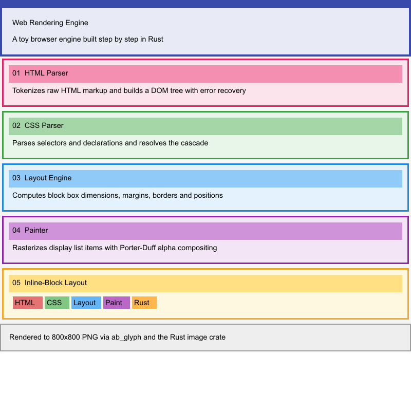

# web-rendering-engine

A minimal web rendering engine written in Rust. It takes an HTML file and a CSS file as input, runs them through a full rendering pipeline, and writes the result to a PNG image.

## Preview



## What it does

The engine implements the classic browser rendering pipeline in simplified form:

1. **HTML parsing** — reads an HTML document and builds a DOM tree
2. **CSS parsing** — reads a CSS stylesheet and builds a list of rules
3. **Style tree** — matches CSS rules against DOM nodes and computes their properties
4. **Layout** — calculates the position and size of every box on the page
5. **Painting** — rasterizes the layout to a pixel buffer and saves it as a PNG

## Project structure

```
src/
  text_parser.rs    low-level character-by-character parsing utilities
  html_parser.rs    HTML parser, produces a DOM tree
  css_parser.rs     CSS parser, produces a stylesheet
  dom.rs            DOM node types (element, text, comment)
  css.rs            CSS data types (selectors, values, rules, stylesheet)
  style.rs          CSS rule matching and style tree construction
  layout.rs         CSS box model and block layout algorithm
  painting.rs       display list generation and canvas rasterization
  lib.rs            re-exports all modules as a public library
  main.rs           command-line entry point

tests/
  rendering.rs      end-to-end integration test for the full pipeline

examples/
  test.html         sample HTML document
  test.css          sample CSS stylesheet
```

## Requirements

You need Rust and Cargo installed. If you don't have them yet, follow the guide at https://www.rust-lang.org/learn/get-started.

## Running

Clone the repository and run it with Cargo. By default it reads `examples/test.html` and `examples/test.css` and writes `output.png`.

```bash
git clone https://github.com/federicobaldini/web-rendering-engine
cd web-rendering-engine
cargo run
```

You can point it at different files using command-line flags:

```bash
cargo run -- --html path/to/file.html --css path/to/file.css --output result.png
```

## Testing

```bash
cargo test
```

This runs both the unit tests (one per module) and the integration test that exercises the full HTML to PNG pipeline.

## What is supported

**HTML**

The parser handles elements, text nodes, comments, self-closing tags (`br`, `img`, `input`, `meta`, `link`, `hr`), and attributes with single or double quotes. It recovers gracefully from common errors: boolean attributes without a value, unquoted attribute values, unclosed elements, and mismatched closing tags.

**CSS**

The parser handles type, id, and class selectors with specificity-based cascade ordering. Supported values are pixel lengths, hex colors (`#RRGGBB`), and keywords. It recovers from invalid declarations by skipping them and from invalid rules by skipping the whole block.

**Layout**

The engine implements the CSS block and inline layout algorithms from the CSS 2.1 specification, including the box model (content, padding, border, margin), automatic width distribution, vertical stacking of block children, and horizontal placement of inline children with line wrapping.

**Painting**

Each element's background and borders are painted to a pixel buffer. The result is saved as a PNG using the `image` crate.

## What is not yet supported

Text color and font size are not inherited from parent elements yet, so all text renders in black at 16px regardless of CSS. Text rendering depends on the Arial font at `/System/Library/Fonts/Supplemental/Arial.ttf`; on systems where that file is absent, text is silently skipped. Other missing features are tracked in `TODO.md`.
